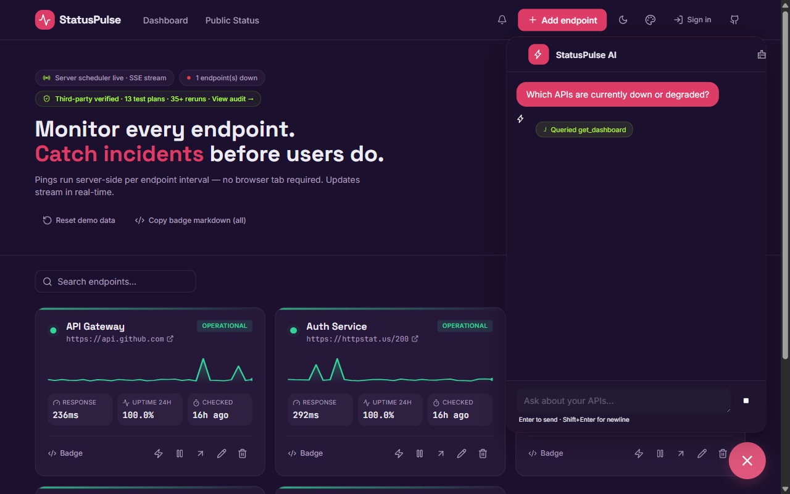

# StatusPulse

> **The API monitoring platform you can chat with.**
>
> *"What broke?" · "Why?" · "How do I fix it?"*

[](https://statuspulse.edgeone.dev)
[](./LOOP.md)
[](./LICENSE)

---

## 🎥 Demo

▶️  [**Open live demo**](https://statuspulse.edgeone.dev/dashboard) — click the AI bubble in the bottom-right corner.



| | |
|---|---|
| 📸 **Dashboard** | Real-time monitoring with sparklines |
| 💬 **AI Chat** | Ask "Which APIs are down?" — answers from live data |
| 🏥 **Diagnostic** | Auto-classifies 7 incident types |
| 📚 **Knowledge Base** | Citation-backed runbook search |

---

## Reproducible Demo

All screenshots in this README are generated automatically — no manual editing.

```bash
npm run demo
```

Outputs: `demo-01-dashboard.png` → `demo-02-ai-opened.png` → `demo-03-question-typed.png` → `demo-04-ai-responded.png` → `demo-05-full-response.png` → `demo-06-final.png` + video recording.

---

## What makes StatusPulse different

Traditional monitoring tells you **what** broke.

StatusPulse tells you **what**, **why**, how **severe** it is, and what to **do about it** — and then lets you ask follow-up questions.

```
┌─────────────────────────────────────────────┐
│  🔴 Payments API — DOWN                     │
│                                             │
│  🏥 Incident Diagnostic                     │
│  Type: server_error_5xx                     │
│  Severity: CRITICAL                         │
│  Finding: Connection pool exhaustion        │
│                                             │
│  📚 Matching Runbook:                       │
│  "Database Connection Pool Exhaustion"       │
│  Fix: Increase pool size + add retry logic   │
│                                             │
│  💬 "Which other endpoints are affected?"   │
└─────────────────────────────────────────────┘
```

---

## Built with Loop Engineering

> *A loop with no real checker doesn't fail loudly. It hallucinates progress.*

StatusPulse wasn't built with one-shot prompting. Every feature followed the TestSprite loop:

```
Write ──→ Verify ──→ Fix ──→ Verify Again
  │          │         │          │
  Agent     TestSprite  Agent     TestSprite
  ships     runs real   reads     reruns
  code      tests       failure   → passes
                         bundle    → banks
```

| | |
|---|---|
| **Loop iterations** | 30 |
| **Verification reruns** | 35+ |
| **Test plans** | 17 (14 frontend + 3 `--type backend`) |
| **Pass rate** | 100% |
| **Regressions found** | 6 real bugs |
| **LOOP.md** | [267-entry audit trail](./LOOP.md) |

**Example from the build log:**

```
1. Created dark/light theme toggle
2. TestSprite: FAILED — animation broken on Safari
3. Fixed CSS pseudo-elements for Safari
4. TestSprite: FAILED — z-index wrong in Chrome
5. Fixed layering → PASSED. 5 cycles to resolve.
```

This is documented across 30 iterations in [LOOP.md](./LOOP.md) — a 267-entry engineering journal with Failure Bundles, root cause analysis, [engineering trade-offs](./LOOP.md#engineering-trade-offs), and [5 moments where TestSprite genuinely changed the project](./LOOP.md#how-testsprite-changed-this-project).

---

## Features

| Category | Capabilities |
|----------|-------------|
| **Monitoring** | Real-time SSE dashboard · Search · Filter by status · 30-day ping history |
| **Status Page** | Public `/status` with uptime heatmaps · Embeddable SVG badges · Email incident subscription |
| **Alerts** | Slack · Discord webhooks — multi-channel outage notifications |
| **AI Assistant** | Natural language queries · Tool calling · Streaming responses |
| **Incident Diagnostic** | 4-stage pipeline: Triage → Classify → Analyze → Recommend |
| **Knowledge Base** | TF-IDF search · Citation-backed answers · Seeded runbook documents |
| **Customization** | Dark/light mode · Accent color sync · Responsive layout |
| **Security** | Route-level auth · Input validation · Prompt injection guardrails · Content filter |

---

## Architecture

```
Browser
  ├── Dashboard (/dashboard)
  ├── Status Page (/status)
  ├── AI Widget (/widget)
  └── Embed (embed.js → iframe)
       │
       ▼
Next.js API Routes
  ├── /api/chat → AI Model (streaming SSE)
  ├── /api/diagnose → Incident Diagnostic Pipeline
  ├── /api/kb/search → Knowledge Base
  └── /api/dashboard → MongoDB
       │
       ▼
External Services
  ├── LLM API (chat + reasoning)
  └── Search API (troubleshooting)
```

---

## Security

Full audit in [SECURITY.md](./SECURITY.md).

| Area | Approach |
|-------|----------|
| **Auth** | NextAuth v5 + route-level checks |
| **Input** | Zod validation · XSS filter · NoSQL injection prevention |
| **AI Guardrails** | Prompt injection detection (27 patterns) · Output guard · Content filter |
| **Data** | AES-GCM encryption · SHA-256 IP hashing · API key rotation |

---

## Quick Start

```bash
git clone https://github.com/0xshalah/StatusPulse.git
cd StatusPulse
npm install
cp .env.example .env
npm run dev
```

Open `http://localhost:3000/dashboard` — click the AI bubble in the bottom-right corner.

---

## Tech Stack

| Layer | Technology |
|-------|-----------|
| **Frontend** | Next.js 15 · React · Tailwind · Framer Motion |
| **Backend** | Next.js API Routes · TypeScript · Zod · SSE Streaming |
| **Database** | MongoDB · Prisma · Redis |
| **Queue** | BullMQ |
| **AI** | LLM · Web Search · LangGraph-style state machine · TF-IDF |
| **Auth** | NextAuth v5 · GitHub OAuth |
| **Testing** | TestSprite CLI · Vitest |
| **CI/CD** | GitHub Actions |

---

## License

Apache 2.0 © 2026 StatusPulse

Built by [shalahuddin](https://github.com/0xshalah) with AI Coding Agent + TestSprite CLI for [TestSprite Hackathon S3](https://www.testsprite.com/hackathon-s3).
